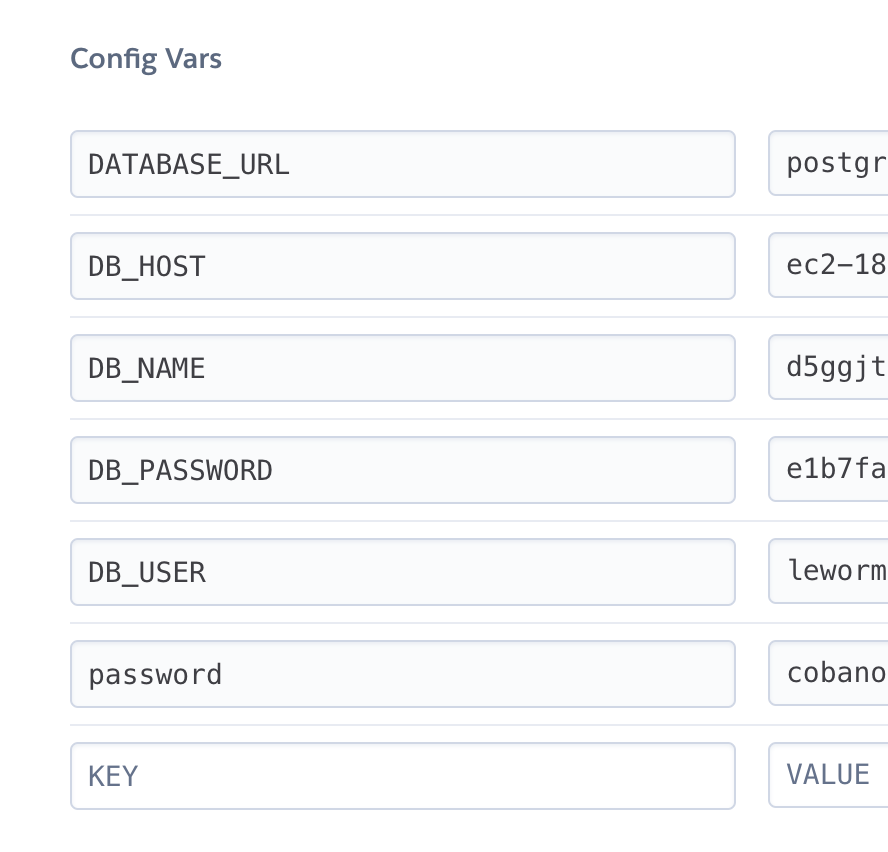

# DEMC Homework

## Kullanim

Sorularin cozumleri [solutions](/solutions) klasoru altindaki readme dosyasinda detayli bir sekilde anlatilmistir. ayni zamanda farkli klasorlerin altinda daha detayli bilgiye ulasmak icin o bolumlerdeki readme dosyalari okunmasi onerilir.

## Kurulum

### 1. Python ve Araclarin Kurulumu

Kurulum icin [pip](https://pip.pypa.io/en/stable/) paket yukleyicisini kurun.

Proje icin virtual environment siddetle onerilir:

```bash
python3 -m venv venv
```

Asagidaki kod kurulum icin ihtiyaciniz olan kutuphanelerin kurulumunu yapacaktir.

```bash
pip install -r requirements.txt
```

- mariadb
- requests
- beautifulsoup4
- mysql-connector-python
- flask
- gunicorn

```bash
brew install --cask mysql-connector-python
```

### 2. MySQL Kurulumu

Mac cihazlar icin en kolay MySQL kurulumu brew uzerinden yapilmaktadir.

1. MySQL Kurulumu ve servisin baslatilmasi:

```bash
brew install mysql
brew services start mysql
mysql_secure_installation
```

### 3. Docker Kurulumu

Projeyi dockerize etmek icin gerekli altyapi ve dosyalar mevcut fakat gecici bir sureligine iptal edilmistir.

### 4. Heroku Deployment

Heroku deploymenti icin dizin icerisinde Procfile, requirements.txt ve x adinda uc dosya bulunmaktadir. Bunlar heroku tarafinda olusturulacak container, paket bagimliliklari ve port aktarimlari icin yazilmistir. Detayli bilgi icin heroku dokumantasyonu.

## Kullanim

### 1. Verilerin Indirilmesi ve Dosya Hazirliklari

IMDb Datasetleri [linkten](https://datasets.imdbws.com/) veya [dataset_download.py](dataset_download.py) scripti ile indirilebilir.

1. Indirilen dosyalari indirmek ve extract etmek icin:

```bash
python3 -m dataset_download.py
python3 -m datasets/unzip_files.py
```

### 2. Tablolarin Olusturulmasi ve Verilerin Aktarimi

1. MySQL Arayuzune giris:

```bash
mysql -u root -p
```

2. Database'i yaratin ve tablolari olusturun:

```bash
source /Users/mertcobanoglu/Repos/demc-homework/database/initialize_tables.sql
```

3. Verileri tablolara import edin

```bash
source /Users/mertcobanoglu/Repos/demc-homework/database/import_data.sql
```

### 3. Webapp Flask

Heroku deploymenti icin uyumlu olmasi adina flask appini ana dizinden calistirmak kolaylik sagliyor. Ayni zamanda webapp asagidaki komut ile calistirilabilir. `localhost:5000` adresinden ziyaret edilecektir.

```bash
python3 wsgi.py
```

### 4. Heroku

Heroku deploymenti icin [database](database) klasoru altindaki [db_utils.py](database/db_utils.py) dosyasinda veritabani baglanti degiskenleri AWS RDS'den alinan bilgilerle degistirilmelidir. Bu bilgiler db bilgilerini kaynak koda eklememek adina config vars altinda environmental variables olarak girilmesi tavsiye edilir.



## Dataset

### 0. Dump Linki:

[GDrive](google.com) Upload in progress, will be updated.

### 1. Start a mariadb server instance

`docker run --name imdb -p 3306:3306 -e MYSQL_ROOT_PASSWORD=55347314 linuxserver/mariadb`

`brew install mariadb`

`pip3 install mariadb`

### 2. IMDb Datasets

Source: https://www.imdb.com/interfaces/

**IMDb Dataset Details**Each dataset is contained in a gzipped, tab-separated-values (TSV) formatted file in the UTF-8 character set. The first line in each file contains headers that describe what is in each column. A ‘\N’ is used to denote that a particular field is missing or null for that title/name. The available datasets are as follows:

<details>
<summary> <b> title.akas.tsv.gz </b> </summary>

- titleId (string) - a tconst, an alphanumeric unique identifier of the title

- ordering (integer) – a number to uniquely identify rows for a given titleId

- title (string) – the localized title

- region (string) - the region for this version of the title

- language (string) - the language of the title

- types (array) - Enumerated set of attributes for this alternative title. One or more of the following: "alternative", "dvd", "festival", "tv", "video", "working", "original", "imdbDisplay". New values may be added in the future without warning

- attributes (array) - Additional terms to describe this alternative title, not enumerated

- isOriginalTitle (boolean) – 0: not original title; 1: original title

</details>

<details>
<summary> <b> title.basics.tsv.gz </b> </summary>

- tconst (string) - alphanumeric unique identifier of the title

- titleType (string) – the type/format of the title (e.g. movie, short, tvseries, tvepisode, video, etc)

- primaryTitle (string) – the more popular title / the title used by the filmmakers on promotional materials at the point of release

- originalTitle (string) - original title, in the original language

- isAdult (boolean) - 0: non-adult title; 1: adult title

- startYear (YYYY) – represents the release year of a title. In the case of TV Series, it is the series start year

- endYear (YYYY) – TV Series end year. ‘\N’ for all other title types

- runtimeMinutes – primary runtime of the title, in minutes

- genres (string array) – includes up to three genres associated with the title

</details>

<details>
<summary> <b> title.crew.tsv.gz </b> </summary>

- tconst (string) - alphanumeric unique identifier of the title

- directors (array of nconsts) - director(s) of the given title

- writers (array of nconsts) – writer(s) of the given title

</details>

<details>
<summary> <b> title.episode.tsv.gz </b> </summary>

- tconst (string) - alphanumeric identifier of episode

- parentTconst (string) - alphanumeric identifier of the parent TV Series

- seasonNumber (integer) – season number the episode belongs to

- episodeNumber (integer) – episode number of the tconst in the TV series

</details>

<details>
<summary> <b> title.principals.tsv.gz </b> </summary>

- tconst (string) - alphanumeric unique identifier of the title

- ordering (integer) – a number to uniquely identify rows for a given titleId

- nconst (string) - alphanumeric unique identifier of the name/person

- category (string) - the category of job that person was in

- job (string) - the specific job title if applicable, else '\N'

- characters (string) - the name of the character played if applicable, else '\N'

</details>

<details>

<summary> <b> title.ratings.tsv.gz </b> </summary>

- tconst (string) - alphanumeric unique identifier of the title

- averageRating – weighted average of all the individual user ratings

- numVotes - number of votes the title has received

</details>

<details>
<summary> <b> name.basics.tsv.gz </b> </summary>

- nconst (string) - alphanumeric unique identifier of the name/person

- primaryName (string)– name by which the person is most often credited

- birthYear – in YYYY format

- deathYear – in YYYY format if applicable, else '\N'

- primaryProfession (array of strings)– the top-3 professions of the person

- knownForTitles (array of tconsts) – titles the person is known for

</details>

## Contributing

Pull requests are welcome. For major changes, please open an issue first to discuss what you would like to change.

Please make sure to update tests as appropriate.

## License

[MIT](https://choosealicense.com/licenses/mit/)
