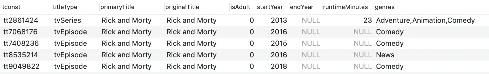
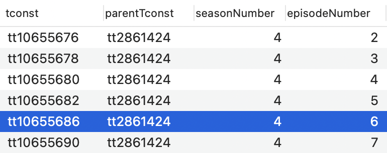

# Solutions

## 1) Rick and Morty

## Hazirlik

Sectigim dizi `Rick and Morty` oldugu icin oncelikle `title_basics` tablosundan karsilik gelen keyini bulmam gerekiyor.

```sql
select * from title_basics where originalTitle='Rick and Morty'
```



```
tconst -> tt2861424
```

Bu sorunun cozumu icin yukarida buldugumuz `tconst`'a sahip tum episodelari bulmamiz gerekiyor. Bu yuzden oncelikler `episodes` tablosuna gidiyorum.

```sql
select * from episodes where parentTconst='tt2861424'
```


Goruldugu gibi `parentTconst` ilgili dizinin benzersiz kodunu tutarken, bu kez tconst ilgili bolumun ismini tutuyor. `ratings` tablosuyla eslesen vote ve rate degerlerini join etmemiz gerekiyor.

Bu tabloyu asagidaki cogu yerde kullanacagiz isleri kolay hale getirmek icin bu episodelarin tutuldugu SQL sorgusundan bir VIEW yaratalim.

```sql
CREATE VIEW rm_episodes AS
SELECT *
FROM episodes
WHERE parentTconst='tt2861424'
```

1. Seçtiğiniz dizinin IMDB average rating'i en yüksek olan 5 bölümü

```sql
SELECT *
FROM rm_episodes
LEFT JOIN ratings
ON rm_episodes.tconst = ratings.tconst
ORDER BY averageRating
DESC
LIMIT 5;
```

2. Seçtiğiniz dizinin IMDB average rating'i en düşük olan 5 bölümü

```sql
SELECT *
FROM rm_episodes
LEFT JOIN ratings
ON rm_episodes.tconst = ratings.tconst
ORDER BY averageRating
ASC
LIMIT 5;
```

3. Seçtiğiniz dizinin IMDB'de en çok kişi tarafından oylanmış 5 bölümü

```sql
SELECT *
FROM rm_episodes
LEFT JOIN ratings
ON rm_episodes.tconst = ratings.tconst
ORDER BY numVotes
DESC
LIMIT 5;
```

4. Seçtiğiniz dizinin IMDB'de en az kişi tarafından oylanmış 5 bölümü

```sql
SELECT *
FROM rm_episodes
LEFT JOIN ratings
ON rm_episodes.tconst = ratings.tconst
ORDER BY numVotes
ASC
LIMIT 5;
```

2. Genel Sorulari

1) 2000-2010 arasında oyuncularından biri tarafından yönetilmiş filmlerin
   listesi

2) 2000 yılından günümüze bir filmde müzik departmanında da yer almış
   aktrislerin listesi

3) 4 ya da daha fazla aktris bulunduran filmlerin sayısı
